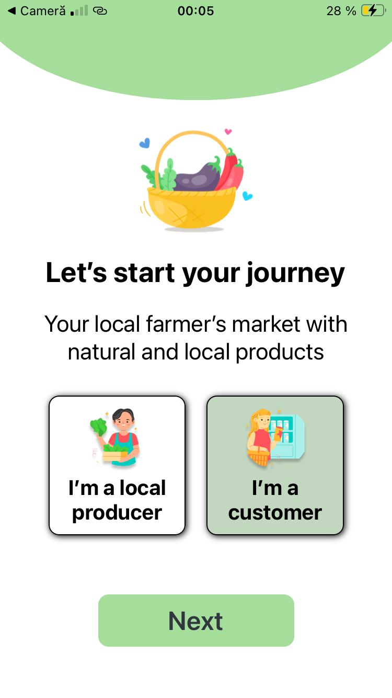
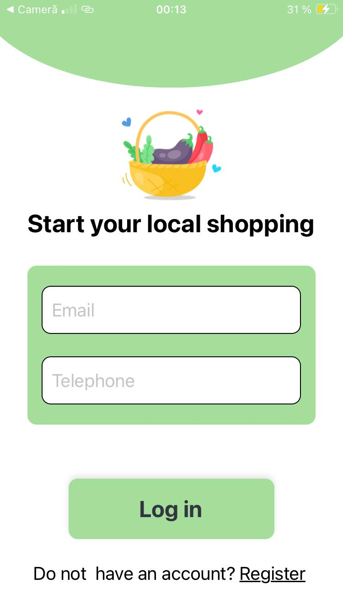
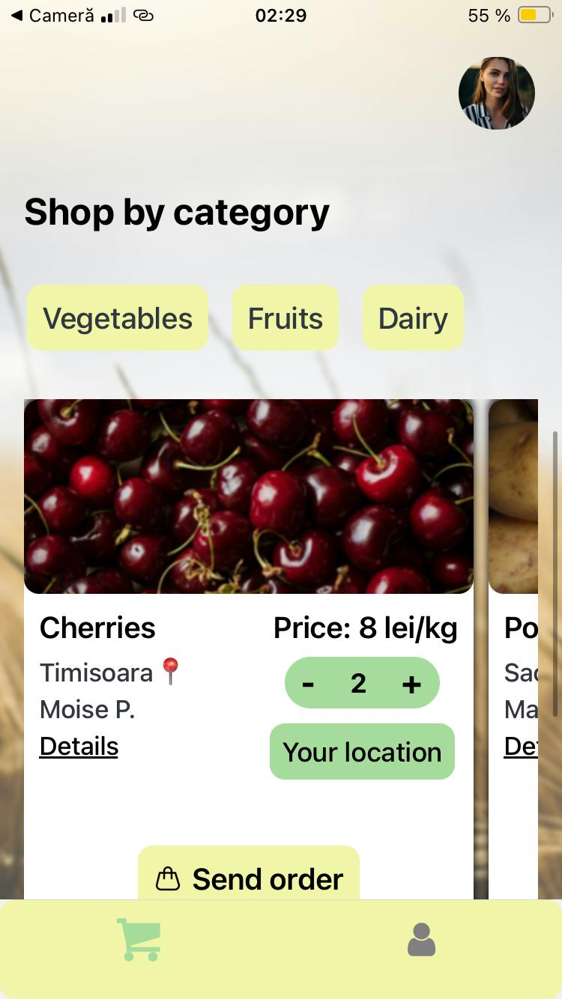
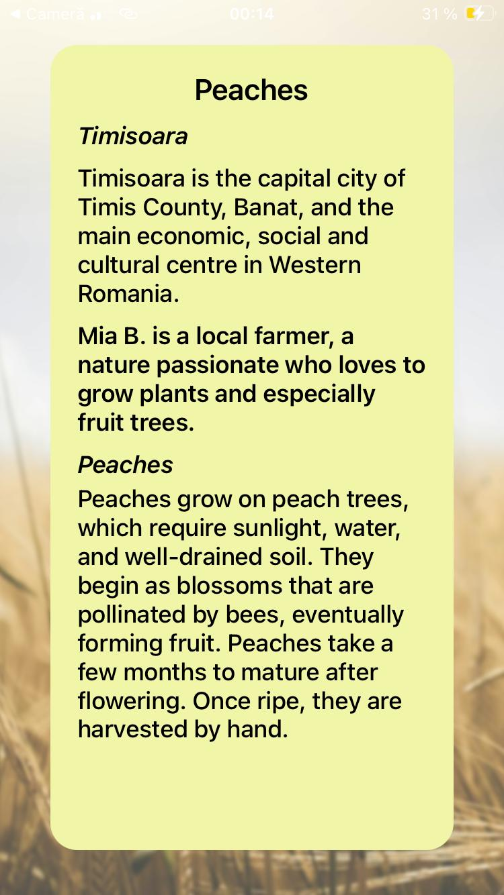
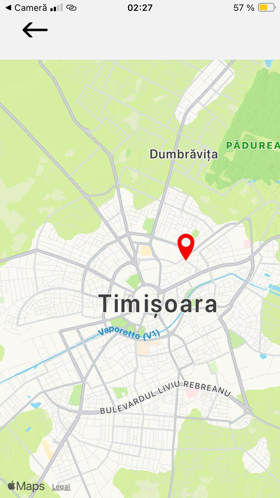
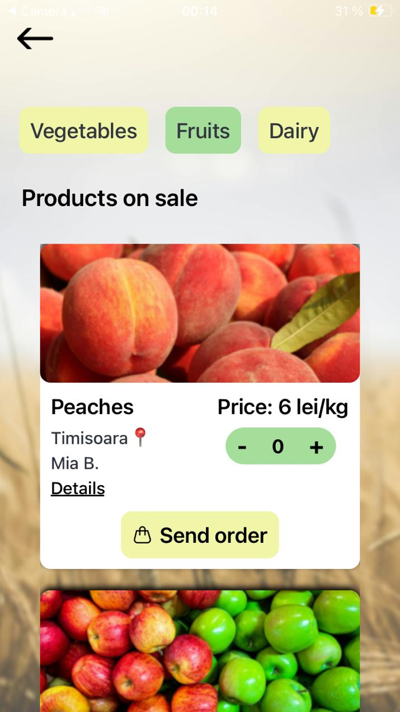
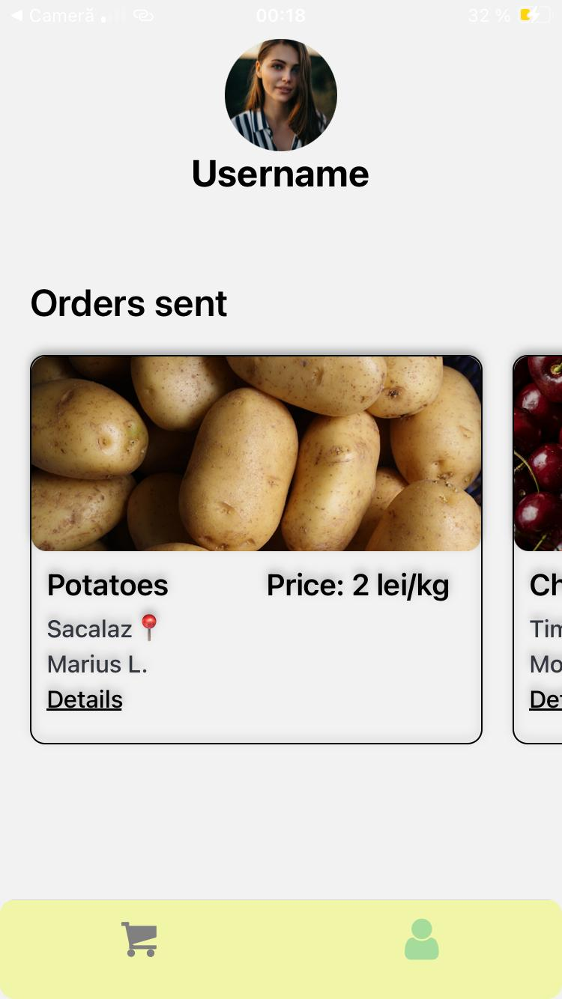

<h1> <b>FarmShop🌿</b></h1>

<b>FarmShop</b> is a user-friendly mobile application that serves as a <b>virtual farmers' market</b>, connecting <b>local producers<b> directly with <b>consumers</b>. With FarmShop, producers can easily showcase their fresh produce, homemade goods, and artisanal products, while customers enjoy the convenience of browsing and purchasing locally sourced items from the comfort of their own homes.Customers could see the prices, the products available, the categories of products and the details about the producers and growing or development of the products. 

This mobile  prototype application was developed during 48 hours hackathon  ITFest for the SmartCity track and it's purpose is to help the digitization of the farmares market and to to increase the level of information on the products. We develop the part of the app which is designed for customers, to show how it will work and the efficienty of it.

<h2>App structure:</h3>
 <h3> 🚀Landing and Authentication</h4>
<ul>
  <li><b>Landing Screen</b></li>
    
     
  <li><b>Login Screen</b></li>
   
   
</ul>
  

  <h4>📲App screens</h5>
  <ul>
  <li><b>Shop Screen</b></li>
    
    
  <li><b>Details for products screen</b></li>
    
     
  <li><b>Map Screen</b></li>
    
     
  <li><b>Ordering Screen</b></li>
    
     
  <li><b>Category Screen</b></li>
    
     
  <li><b>Customers profile Screen</b></li>
    
</ul>
